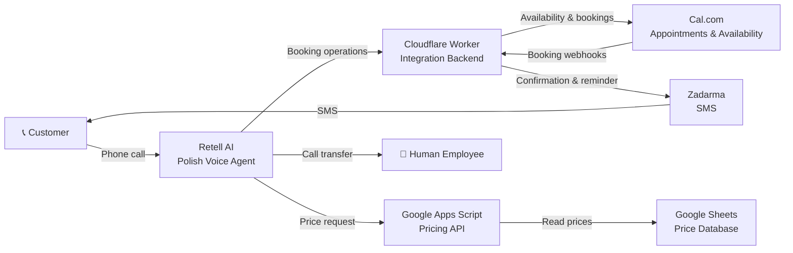

# TurboGuma AI Receptionist

A working end-to-end prototype of an AI-powered phone receptionist built for a fictional Polish tire service.

The system handles incoming phone calls in Polish, provides service pricing, checks appointment availability, creates and manages bookings, sends SMS confirmations and reminders, and can transfer the caller to a human employee.

The project was built and tested as a real MVP using external APIs, webhooks and serverless infrastructure.

## What the system can do

During a phone call, the AI receptionist can:

- answer common customer questions in Polish,
- calculate service prices using an external price database,
- check real appointment availability,
- create appointments,
- find existing appointments using the caller's phone number,
- cancel appointments,
- reschedule appointments,
- send SMS booking confirmations,
- send automatic SMS reminders before appointments,
- transfer the call to a human employee when necessary.

The AI is not treated as the source of truth for prices or appointment availability. These are retrieved from external systems.

## Architecture


The project combines several independent services:

**Retell AI**
- handles the phone conversation,
- speech recognition and voice generation,
- determines when backend tools should be called.

**Cloudflare Worker**
- acts as the main backend and integration layer,
- communicates with Cal.com,
- processes booking operations,
- handles Cal.com webhooks,
- sends SMS messages,
- schedules and retries reminders,
- validates requests and booking ownership.

**Cal.com**
- stores appointments,
- provides real-time availability,
- handles booking, cancellation and rescheduling.

**Google Apps Script + Google Sheets**
- provides the pricing API,
- stores the authorized service price table,
- calculates base prices and surcharges.

**Zadarma**
- provides SMS delivery used for booking confirmations and reminders.

## Example workflow

A typical booking looks like this:

1. Customer calls the AI receptionist.
2. Retell AI conducts the conversation in Polish.
3. The customer asks for a tire replacement price.
4. Retell collects the required vehicle/service parameters.
5. The `get_price` API retrieves the authorized price.
6. The customer requests an appointment.
7. The AI checks availability in Cal.com.
8. The customer confirms the selected time.
9. The Cloudflare Worker creates the booking.
10. Cal.com sends a webhook event.
11. The Worker sends an SMS confirmation.
12. Before the appointment, an automatic SMS reminder is sent.

The customer can later call again to find, cancel or reschedule the same appointment.

## Pricing system

Prices are not stored inside the AI prompt.

Instead, the agent sends structured parameters to a separate pricing API:

- service type,
- wheel/rim type,
- wheel size,
- SUV status,
- RunFlat status.

The Google Apps Script backend reads the authorized price table from Google Sheets and calculates:

`final price = base price + applicable surcharges`

This prevents the language model from inventing or modifying prices.

## Booking security

Appointment management includes additional validation.

When a caller wants to cancel or reschedule an appointment:

1. the system identifies the caller using the phone number provided by the telephony system,
2. retrieves matching future bookings,
3. obtains the real booking UID from Cal.com,
4. verifies that the booking belongs to the caller,
5. only then performs the requested operation.

The agent is not allowed to invent booking identifiers.

## Reliability

The backend includes mechanisms for handling failures and duplicate operations, including:

- booking deduplication,
- SMS deduplication,
- SMS retry handling,
- webhook signature verification,
- input validation,
- controlled error responses,
- scheduled reminder processing.

Production logs were designed to avoid logging full phone numbers, SMS contents or booking data.

## Human handoff

The AI handles normal customer-service workflows independently.

When the caller explicitly requests a human or the request cannot safely be handled automatically, the conversation can be transferred to an employee.

This provides a fallback instead of forcing the AI to answer outside its defined capabilities.

## Technologies

- JavaScript
- Cloudflare Workers
- Cloudflare KV
- Cloudflare Queues
- Retell AI
- Cal.com API
- Cal.com Webhooks
- Google Apps Script
- Google Sheets
- Zadarma API
- REST APIs
- Webhooks

## Project structure

```text
turboguma-ai-receptionist/
├── README.md
├── src/
│   ├── cloudflare-worker/
│   │   └── worker.js
│   └── pricing-api/
│       └── pricing-api.js
├── config/
│   ├── retell-system-prompt.txt
│   └── retell-tools.md
└── docs/
    ├── demo/
    └── screenshots/
```

## Testing

The complete workflow was tested end-to-end using real phone calls.

Tests included:

- service pricing,
- appointment availability,
- appointment creation,
- SMS confirmation delivery,
- appointment lookup,
- cancellation,
- rescheduling,
- reminder delivery,
- transfer to a human.

The prototype successfully completed the complete flow from a phone conversation to an appointment and SMS confirmation.

## Security

Production secrets are intentionally excluded from this repository.

Credentials used by the system include:

```text
CAL_API_KEY
CALCOM_WEBHOOK_SECRET
RETELL_BOOKING_KEY
ZADARMA_KEY
ZADARMA_SECRET
PRICE_API_KEY
```

These were stored using environment variables or platform secret stores rather than being committed directly to source code.

Any screenshots included in the public version of this repository must have personal information and credentials removed.

## Project status

The technical MVP was completed and tested successfully.

The project was originally explored as a potential commercial product for Polish automotive service businesses. After building the prototype and conducting initial market validation, I decided not to continue commercialization.

The project is preserved as an engineering case study demonstrating the design and implementation of a complete AI-assisted phone automation workflow.

## What I learned

This project provided practical experience with:

- integrating multiple third-party APIs,
- designing event-driven workflows,
- working with webhooks,
- serverless backend development,
- API authentication,
- handling asynchronous operations,
- validating AI-generated tool calls,
- separating AI reasoning from authoritative business data,
- implementing retries and deduplication,
- designing human fallback mechanisms,
- testing a complete system end-to-end.

It also demonstrated an important product lesson: successfully building a technical solution does not automatically mean that the market problem is strong enough to justify commercialization.
